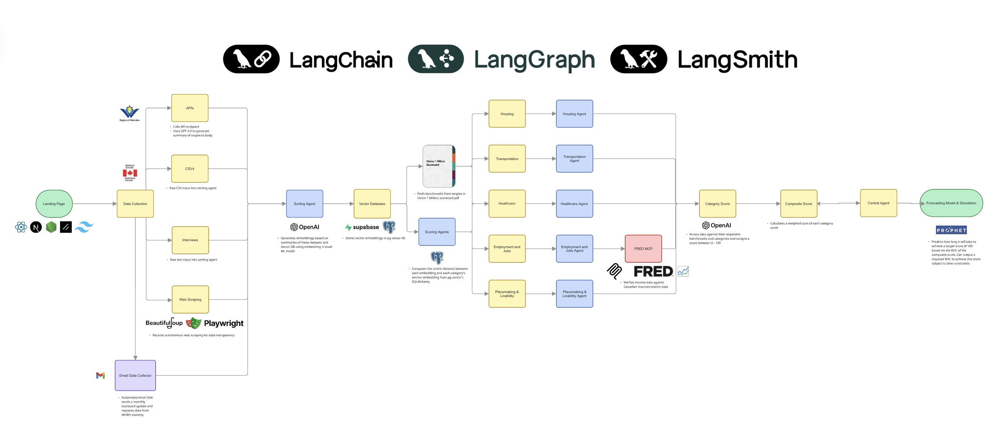

# Forecast

Forecast is a prototype automation platform for the Future Cities Institute's Vision One Million Scorecard. It is designed to reduce the manual work required to update Waterloo Region's readiness scorecard across five sectors: housing, transportation, healthcare, employment, and placemaking.

The codebase addresses this problem by automating the collection, normalization, scoring, storage, and review of civic datasets that are currently gathered through a slow and error-prone manual process. The goal is to turn a six-month spreadsheet-driven refresh cycle into a maintainable, auditable data pipeline with transparent scoring and review workflows.

## Problem Alignment

The Vision One Million Scorecard exists to answer a practical planning question: is Waterloo Region building the homes, transit, healthcare capacity, jobs, and place-based infrastructure needed to support growth toward one million residents?

Today, answering that question requires researchers to:

- monitor many federal, provincial, regional, municipal, and sector-specific sources
- fetch data from APIs, websites, files, and reports that update on inconsistent schedules
- clean and normalize heterogeneous inputs
- calculate sector metrics and benchmarks manually
- explain score changes to stakeholders with limited traceability

This repository prototypes an automated alternative:

- ingest structured and semi-structured civic data from URLs, APIs, streams, and scraped sources
- normalize and summarize raw source material into planner-friendly structured records
- generate embeddings and score datasets against sector benchmark anchors
- aggregate readiness scores across the five scorecard sectors
- run specialist AI assessments that explain current conditions and recommend actions
- preserve artifacts, historical records, and evidence trails for review

## How The System Solves The Problem

The platform is organized as a backend-first scorecard automation stack with a frontend review surface.

### 1. Source Intake and Data Collection

The system supports multiple ingestion paths because the scorecard depends on sources with very different access patterns.

- API and endpoint ingestion: the classifier can fetch and summarize JSON and endpoint payloads, including ArcGIS-style service metadata and response previews.
- Web scraping: dedicated scraping utilities support sources that do not expose clean APIs.
- Semi-structured source capture: Playwright-based recording is used to preserve source evidence for later review.
- External economic context: the employment workflow can enrich local evidence with FRED data through an MCP server.

This design directly addresses the requirement to combine official APIs where possible with scraping and fallback capture where APIs are incomplete or unavailable.

### 2. Data Validation and Normalization

Raw inputs are classified and transformed before scoring.

- URLs are fetched and converted into normalized text summaries.
- JSON payloads are flattened into analyzable text.
- CSV-like inputs are normalized into compact summaries with row counts, categories, and numeric aggregates.
- Structured LLM output is validated with Pydantic schemas, with retry logic when the model response does not satisfy the required schema.

This helps reduce manual cleaning effort while still enforcing structure, consistency, and basic data quality safeguards.

### 3. Scorecard Metric Transformation

Once normalized, each dataset is converted into a structured summary containing:

- title
- domain
- geography
- time period
- extracted key metrics
- civic relevance
- data quality notes

Those summaries are embedded and compared against benchmark anchor embeddings for the five scorecard sectors. Benchmark evaluators then convert extracted metrics into normalized sector evidence, which is combined with semantic similarity to produce dataset-level and category-level scores.

This gives the project a repeatable, explainable path from raw data source to scorecard metric.

### 4. Alerts, Review, and Decision Support

The codebase supports reviewable and explainable outputs rather than opaque automation.

- aggregated category scores can be retrieved via API
- specialist agents generate structured sector assessments with rationale, confidence, supporting evidence, and recommendations
- a central chat agent can explain scores, search datasets, and retrieve stored source recordings
- stored artifacts and recordings allow maintainers to inspect the underlying evidence behind a score

This addresses the need for transparency, auditability, and stakeholder-facing review.

## LangChain, LangGraph, and LangSmith

These three components are central to how the codebase solves the scorecard automation problem.

### LangChain

LangChain is used as the application layer for model-powered reasoning and structured data extraction.

- `ChatOpenAI` powers the summarizer, central planning agent, and specialist category agents.
- structured output via function calling is used to force valid Pydantic responses for dataset summaries and specialist assessments
- embeddings are generated for dataset retrieval and sector scoring workflows
- tool definitions power the central planning assistant's ability to inspect scores, search evidence, and explain results

In practice, LangChain is what lets the system turn messy civic source material into consistent, typed planning records instead of ad hoc LLM text.

### LangGraph

LangGraph is used to orchestrate the ingestion pipeline as an explicit stateful workflow.

The core graph in [backend/langchain/src/forecast/agents/graph.py](/c:/Users/jerem/Forecast/backend/langchain/src/forecast/agents/graph.py) runs the following sequence:

1. classify the incoming source
2. summarize the normalized content
3. generate embeddings
4. persist the dataset and embeddings
5. score the dataset against scorecard benchmarks

This matters for the Vision One Million problem because updating the scorecard is not a single model call. It is a multi-step process with state transitions, persistence, failure handling, and downstream scoring. LangGraph provides a clean execution model for that workflow and makes it easier to extend with new nodes such as anomaly detection, refresh checks, or source-specific validators.

### LangSmith

LangSmith is used for tracing and observability across the AI pipeline.

- ingestion graph nodes are traced
- the dataset summarizer is traced
- central agent chat runs are traced
- specialist agent runs are traced
- FRED MCP tool calls are traced

For this project, LangSmith is not just a developer convenience. It is part of the accountability model. It helps maintainers inspect how a score or recommendation was produced, which is important when the system is used to support public-facing planning decisions and six-month scorecard updates.

## Technical Requirements Coverage

The codebase is structured to address the technical considerations in the problem statement.

### Identify and Map Data Sources

The repository supports ingestion from:

- API endpoints and JSON services
- scraped web pages
- external economic data via MCP and FRED
- local or streamed structured inputs

The architecture separates ingestion, normalization, scoring, and retrieval so that additional sources can be added without rewriting the whole pipeline.

### Automate Data Collection

Automation is handled through:

- FastAPI ingestion endpoints
- Celery background tasks for dataset processing
- scheduled specialist jobs via Celery beat
- dedicated scraping utilities in `backend/tools/`

This provides a foundation for recurring update cycles instead of manual spreadsheet refreshes.

### Validate and Clean the Data

Validation and cleaning are handled through:

- input classification and normalization
- schema-enforced structured outputs
- retry logic for invalid model responses
- summary-level data quality notes
- persistence of source artifacts for review

The current implementation is strongest on structural validation and reviewability. It can be extended with stronger anomaly detection, threshold rules, and freshness checks.

### Transform Data into Scorecard Metrics

The system performs transformation through:

- summary schema extraction of planning-relevant metrics
- benchmark evaluation functions by category
- vector similarity against anchor embeddings
- weighted aggregation into category scores

This creates a reproducible scoring pipeline instead of one-off manual formulas.

### Alert on Updates and Anomalies

The current prototype supports review-oriented monitoring through:

- refreshed category and specialist scores
- reasoning traces from tool-based planning chat
- persisted artifacts and recordings
- scheduled specialist execution

A full production alerting layer such as email, webhook, or Slack notifications can be added on top of the existing background task architecture.

### Document the Process

Documentation is supported through:

- explicit benchmark and context files by category
- traceable LangSmith runs
- persisted dataset summaries and score explanations
- recorded source artifacts for auditability
- a codebase split that separates frontend, LangChain backend, MCP services, and collection tools

## Data Architecture and Storage

The backend uses PostgreSQL, SQLAlchemy, Alembic, and pgvector-oriented patterns to preserve both current and historical scorecard state.

It stores:

- datasets and source references
- structured summaries
- embeddings
- category scores
- specialist assessments
- source recordings and dataset artifacts

This is important for historical tracking, reproducibility, and trend analysis across scorecard refresh cycles.

## API and Product Surface

The backend exposes FastAPI routes for:

- ingestion
- datasets
- scores
- specialist scores
- chat
- health checks

The frontend provides the dashboard layer where maintainers can review outputs, inspect scores, and interact with the planning assistant.

## Repository Structure

- `frontend/`: Next.js dashboard and UI code.
- `backend/langchain/`: Python backend, LangChain application code, scoring logic, tests, migrations, and backend data assets.
- `backend/mcp/`: MCP services, including the FRED MCP server used for external economic context.
- `backend/tools/`: supporting collection utilities such as Gmail tooling and web scraping scripts.

## Current Scope

This repository is a prototype for automated scorecard operations, not yet a complete production monitoring platform. It already demonstrates the core architecture needed for the Vision One Million challenge:

- multi-source data intake
- automated AI-assisted normalization
- benchmark-based scoring
- background processing
- explainable agent workflows
- traceability and evidence capture

That makes it a strong foundation for evolving the scorecard from a periodic manual artifact into a living planning system.
